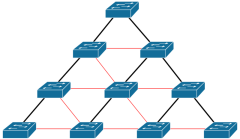

# Spanning Tree Protocol

## Proč se STP používá
Pokud máme topologii v podobném zapojení

Pokud nechceme aby se pakety "zacyklily" a kroužily po switchích, tak je potřeba STP protokol.

## Aplikování STP
