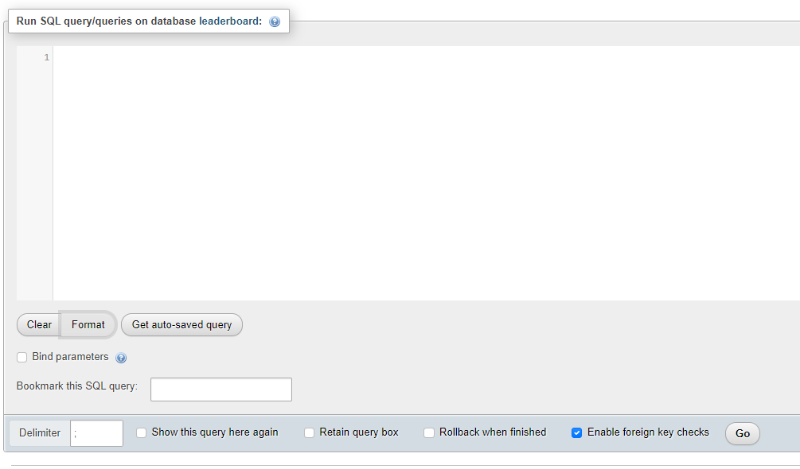

# Používání CLI
* Píšeme tzv. SQL query

## Pomocí příkazového řádku
* Píšeme jako normální SQL query
```bash
C:\xampp\mysql\bin\mysql.exe -u root
```

## Pomocí SQL query v phpMyAdmin
* Dostaneme se pomocí tlačítka SQL nahoře v panelu


:::tip Pokud chceme rovnou zvolit konkretni databázi
klikneme na ní ve výběru databází a poté klikneme na tlačítko SQL 
:::

* Zde pak píšeme SQL kod


