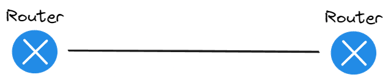
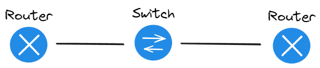

# Routování mezi sítěmi

- Funguje ve 3. vrstvě modelu ISO/OSI
- Využívá se k přenosu dat mezi sítěmi
- Dělí se podle nastavení a náročnosti na routování
  - Statické => nastavíme staticky cestu do jiné sítě
  - Dynamické => cesta se nastaví automaticky

## Statické routování

- Nastavíme staticky cestu do jiné sítě
- Nízká náročnost na HW

```yml title="Nastavení statického routování"
Router(config)#ip route <adresa vzdálené sítě> <maska vzdalené sítě> <next-hop>
```

---

<div class="center">

**Next hop**


_Router 1 je ten, kde nastavujeme ip route_

</div>

---

:::tip Defaultní cesta
Můžeme nastavit defaultní cestu pro routování, pokud router neví, kam poslat paket tak se pošle na defaultní cestu

```yml title="Nastavení defaultní cesty"
Router(config)#ip route 0.0.0.0 0.0.0.0 <next-hop>
```

:::

:::tip Náhradní cesta
Pokud máme více cest do stejné sítě, tak můžeme nastavit náhradní cestu, která se použije, pokud hlavní cesta nebude dostupná

```yml title="Nastavení náhradní cesty"
Router(config)#ip route <adresa vzdálené sítě> <maska vzdalené sítě> <next-hop> <priorita>
```

_priorita slouží k určení, která cesta se použije dříve, čím menší číslo, tím dříve se použije, pokud nízká priorita selže, tak se použije cesta s vyšší prioritou_
:::

## Dynamické routování

- Náročnější na HW

### Autonomní systém

- označuje oblast sítě, která je spravována jedním subjektem (jeden dům s více routery)

### Vnitřní a vnější routování

- **Interior** => protokoly: RIP, IGRP, EIGRP, OSPF
  - Distance vector => spoléhá na routovací tabulky sousedních routerů
  - Link-state => vytváří tabulku sousedů, sbírá informace od všech routerů a pomocí toho si vytvoří mapu a z ní si pak sám vypočítá nejlepší cestu
- **Exterior** => routování zařizuje poskytovatel internetu (ISP)

### RIP _Routing Information Protokol_

- distance-vector
- metrika => počet skoků (max počet skoků je 15)
- malé sítě, nenáročné na HW
- Verze:
  - **RIPv1** => nepoužívat (nefungujou masky)
  - **RIPv2** => lepší
  - **RIPng** => funguje i IPv6 routing
- routery si přeposílají routovací tabulky

**Nastavení RIP**

```yml title="Vyberu nastaveni RIP"
Router(config)# router rip
```

```yml title="Nastavení sousedních sítí v RIP protokolu"
Router(config-router)# network <ip-adresa>
```

<div class="center">

_Nastavujeme všechny sítě, které jsou připojeny k danému routeru._

</div>

---

### OSPF _Open Shortest Path First_

- Používá algoritmus nejkratší cesty (dijstrův algoritmus)
- má 3 tabulky
- Hello paket
  - Posílá se v intervalu
  - Posílají si ho sousedi aby si udělali sousedství
  - Dead interval => routry si neodpovídaj (nejsou spojený), sousedství se ztratí
- Link-state database => databáze celé sítě, kterou si ukládá router
- Dva druhy spojení: point-to-point a mezihost

<div class="collumns-wrapper">
<div style={{ width: "50%", padding: "10px" }} class="center">


_Point to point_

</div>
<div style={{ width: "50%", padding: "10px"  }} class="center">


_Mezihost_

</div>
</div>

**Nastavení OSPF**

```yml title="Výběr skupiny v OSPF protokolu"
Router(config)# router ospf <group-id>
```

```yml title="Nastavení sítě v OSPF protokolu"
Router(config-router)# network <ip-adresa> <wildcard-mask> area <area-id>
```

- **wildcard mask** => inverzní maska (bity jsou obráceně) _255.255.255.0 => 0.0.0.255_
- **area-id** => oblast routování (pokud chceme aby skupina routerů routovala mezi sebou, tak musíme dát stejné číslo)

:::warning area-id
Pokud ti nebude fungovat ospf, pravděpodobně je to protože máš area-id různé od nuly, jestli máš jenom jednu skupinu routerů, tak nastav area-id na 0
:::
