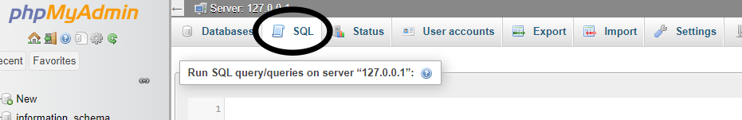

# Jak se dostat do CLI?

Píšeme tzv. SQL query, příkazy, kterými lze upravovat databáze, tabulky a data v nich

## Pomocí příkazového řádku

- Píšeme jako normální SQL query

```bash
C:\xampp\mysql\bin\mysql.exe -u root
```

### Zvolení databáze, se kterou chceme pracovat

1. Pro zobrazení možných databází

```bash
MariaDB [(none)]> SHOW DATABASES;
```

2. Pro zvolení

```bash
MariaDB [(none)]> USE <databáze>;
```

3. Zobrazíme tabulky ve zvolené databázi

```bash
MariaDB [(none)]> SHOW TABLES;
```

4. Zvolíme tabulku

```bash
MariaDB [(none)]> USE <tabulka>;
```

## Pomocí SQL query v phpMyAdmin

- Dostaneme se pomocí tlačítka SQL nahoře v panelu



:::tip Pokud chceme rovnou zvolit konkretni databázi
klikneme na ní ve výběru databází a poté klikneme na tlačítko SQL
:::

- Zde pak píšeme SQL kod
  
