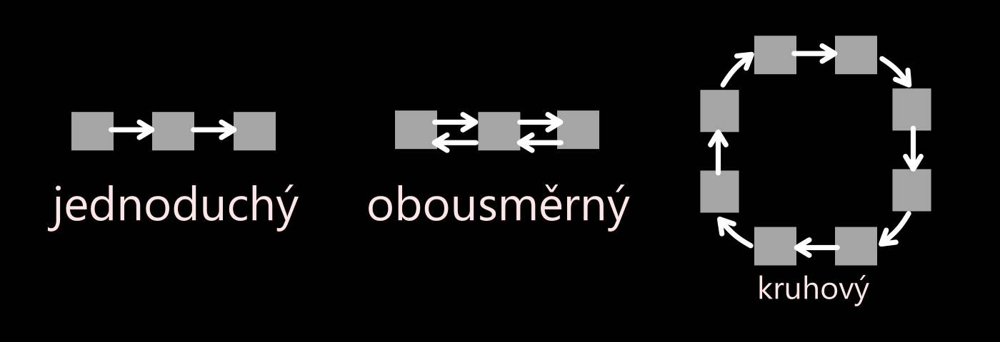
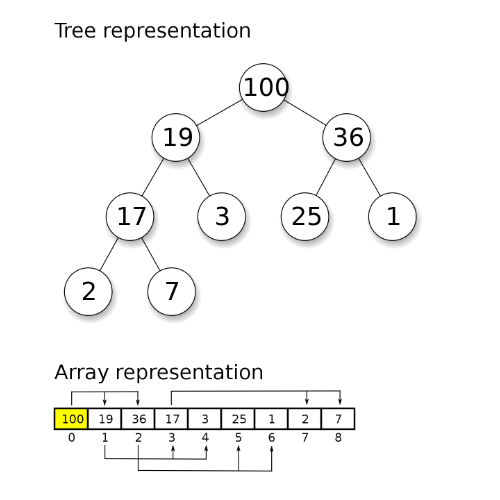
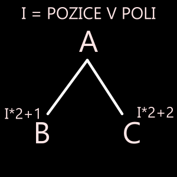
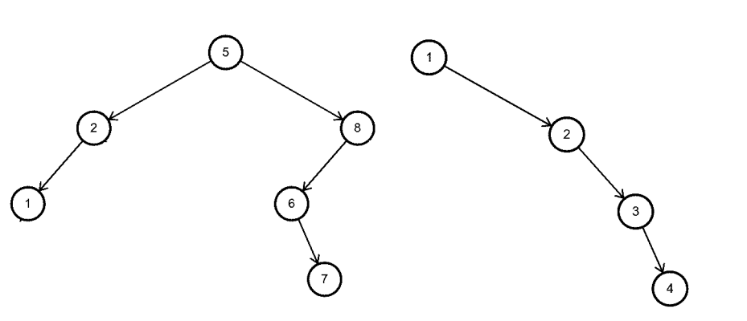
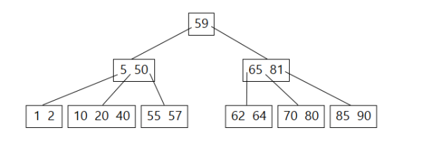

# Datové struktury

## Pole (Array)
- Nejjednodušší datová struktura 
- Statické (pevná velikost)
- Prvky uloženy v paměti hned za sebou

#### Plusy a mínusy pole
\+ Jednoduché na vytvoření <br/>
\+ Jednoduché na použití <br/>
\- Složité vyhledávání<br/>
\- Složité třídění <br/>
\- Dlouhé vyhledávání <br/>
\- Obtížné odstranění prvku

## List
- Dynamické (může měnit velikost)
- Vlastnosti podobné jako v pole
- Výhodu oproti poli je snazší práce s daty

## Množina
- Všechny prvky jsou unikátní (vyskytují se pouze jednou)

#### Plusy množiny
\+ Rychlá kontrola, jestli obsahuje prvek <br/>
\+ Bez duplicitních hodnot


## Fronta a Zásobník 
- anglicky: buffer, queue

### Fronta
- **FIFO** (Last In, First Out) => jako by se zařadil do **fronty** 

:::note Příklad
```
->|3|5|4|2|->
```
:::

#### Přidání / získání prvku do / z Fronty
```c title="Přidání prvku do fronty"
// volá funkci
Fronta.add(x)

// funkce: 
pole[pocet] = x;
pocet++;
```

```c title="Získání prvku z fronty"
// volá funkci:
Fronta.get()

// funkce:
pocet--;
return pole[pocet];
```


### Zásobník 
- **LIFO** (First In, First Out) => jako by se zařadil na **vrchol**

:::note Příklad
prvek **2** by se po přidání **první** odebral
```agl title="Přidání prvků"
->|2|4|5|3|
```
```agl title="Odebrání prvků"
<-|2|4|5|3|
```
:::

#### Přidání / získání prvku do / z Zásobníku
```c title="Získání prvku z fronty"
// volá funkci 
Zasobnik.get();

// funkce:
pom = pole[0];
for (int i = 1; i < pocet - 1; i++)
{
    pole[i] = pole[i + 1];
}
pocet--;
return pom;
```

#### Plusy a mínusy fronty a zásobníku
\+ rychlé přidání, odebrání a zobrazení prvků <br/>
\- nemožnost ukládat doprostřed

## Spojový seznam (link-list)
Dělí se na tři: 
- **jednosměrný** => Každý prvek nese informaci o tom, kde je následující prvek.
- **obousměrný** => každý prvek informaci o tom, kde je předchozí a další prvek.
- **kruhový** => je jednosměrný kde poslední prvek odkazuje na první.



- Prvky oproti poli jsou v paměti rozmístěni různě

#### Plusy a mínusy spojového seznamu
\+ Přidání / odebrání prvků, pouze o změně referencí / pointrů (šipek). <br/>
\- Složitý a zdlouhavý výpis.

# Binární stromy
Stromové struktury, které mají kořen a u každého uzlu mají **dva potomky** => dva -> binární 

## Halda (Heap)

- Nejvyšší prvek je vždy nejmenší / největší
- Každý prvek má nižší/vyšší nebo stejnou hodnotu jako jeho rodič
- Kořen/vrchol obsahuje vždy max/min 
- Je to vyvážený binární strom – je téměř celý naplněný

### ABC Pravidlo
```
A > B, C
--------
A < B, C 
```



#### Plusy a mínusy haldy
\+ Velmi rychlé hledání minima a maxima <br/>
\+ Rychlé přídavní prvků <br/>
\+ Rychlé odebírání maxima / minima <br/>
\- Pomalé vyhledávání <br/>
\- Komplikované odstranění prvku 

:::warning Nevyrovaný seznam 
- obsahuje velké množství jednopotomkových uzlů (nepočítá se poslední/dolní patro)
- extrém (obr.2) = **spojový seznam**


::: 
## Vyvážený vyhledávací binární strom (BST = Binary Search Tree)
- vyjma posledního patra neobsahuje jednopotomkové uzly
- oproti haldě je přesně dané, kde který prvek leží
- vpravo je vždy větší prvek a vlevo menší než hodnota uzlu

**Proces vyhledávání** <br/>
> např.: 7 <br/>
> 5 ≠ 7, ale 7 > 5 → vpravo <br/>
> 8 ≠ 7, ale 7 < 8 → vlevo <br/>
> 6 ≠ 7, ale 7 > 6 → vpravo <br/>
> 7 = 7 → našli jsme!


Strom má 11 prvků, nalezli jsme ve 4 krocích!

#### Plusy a mínusy vyváženého 
\+ umožňuje prvky rychle vyhledávat a optimalizuje jejich vkládání a mazání <br/>
\- složitější manipulace s prvky

## Samovyvažovací stromy
- před vytvořením stromu je nejlepší zamíchat prvky => vyvážený strom
- během „života může strom degradovat na nevyvážený až spojový seznam
- řešením jsou Samovyvažovací stromu = mají metody na kontrolu a následné napravení

## B-Stromy 
- v uzlu může být více prvků
- vytvořeny pro efektivní využití na pevných discích, kdy lze v jednom kroku pracovat s více prvky najednou
- prakticky využívány v databázových systémech
- časové složitosti vycházejí stejně jako binární stromy



:::warning Pozor!
B-Strom není Binární strom!
:::