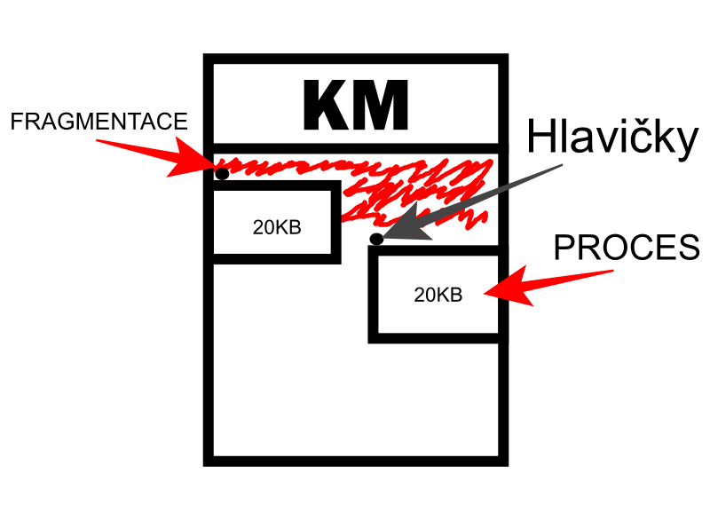

# Správa operační paměti
- OP je paměť přímo přístupná procesoru
- Uchovává kód programů, procesů, mezivýsledky jejich činností, stav ostatních prostředků
- Souvisle adresovatelná paměť rozdělená do buněk
- OP souvislý prostor paměťových buněk o velikosti 1Byte, jež jsou lineárně adresovány
- Pokud je tento adresový prostor přímo reprezentován fyzickou pamětí **RAM**, označujeme jej jako Fyzický adresový prostor **FAP**
- Velikost prostoru je daná

##### Správa FAP musí plnit následující funkce
- **Přidělování** paměťových regionů na požádání procesů
- **Uvolňování** paměťových regionů na žádosti procesů (vždy musí skončit úspěchem)
- **Udržování** informací o obsazení adresového prostoru
- **Zabezpečení** ochrany paměti, brání procesům přistupovat k paměti mimo regiony, které vlastní
- **Podporovat střídavý běh** více procesů

# Metody správy FAP

## Triviální

### Monolitická aplikační paměť
- Nejjednodušší správa OP
- Rozděluje adresový prostor na 2 bloky = souvislá oblast adresového prostoru určená počáteční adresou, bází a velikostí
    1. **První blok** → přidělen rutinám jádra (Kernel Memory - KM)
        - Paměť jádra je sdílena všemi procesy, protože rutiny Jádra, jsou užívány všemi procesy.
    1. **Druhý blok** → přidělován na požádání procesům (Application memory - AM)
        - Paměť aplikační je soukromá a přístup by k ní měl mít pouze proces vlastník

**Algoritmus přidělení regionu**
- Pokud je AM volná, je přidělena procesu celá bez ohledu na jím požadovanou velikost
- Pokud není volná, je požadavek odmítnut → s fatálními důsledky pro proces
- Alokace paměti se tudíž děje jenom jednou při spuštění procesu, kterou využívá po celou dobu svého života
- Paměť je uvolněna při ukončení procesu
- Stačí si pamatovat vlastníka paměti (jediný proces)

**Bázový registr**
- Uložena adresa toho prostoru
- Jeho obsah je automaticky přičítán k adrese použité ve strojovém kódu a teprve tento součet je užit k fyzické adresaci paměťového místa
- Ochrana paměti se omezuje pouze na ochranu paměti jádra (protože v paměti nejsou žádné další regiony)
- Nejjednodušší metodou je použití bázového registru, který fyzicky znemožňuje použití fyzických adres nižších než je báze
- V režimů jádra obsahuje bázový register nulovou adresu a proces tak může přistupovat k celému adresovému prostroru
- Příklad OS: CPM (některé rysy v MSDOS)

### Statické bloky
- Pro informovanost u statických bloků se používá pole
- Komplikuje se i ochrana paměti, protože použití bázového registru chrání bloky jen na nižších adresách
- Pro ochranu bloků na vyšších adresách používáme takzvaný **limitní registr** (obsahuje velikost aktuálního regionu)
- Hodnota lokální adresy je ještě před přičtením bázového registru porovnána s hodnotou limitního, pokud je větší je vyvolána výjimka
- Největší změnou je alokace více bloků jedním procesem
- Adresový prostor procesu je rozdělen na tři hlavní regiony
    1. **Kódový region [ CR ]** = obsahuje strojové kódy (kódy programů), není do něj zapisováno
    2. **Datový region [ DR ]** = obsahuje statická data programů, vyžaduje zápis a čtení
    3. **Zásobníkový region [ SR ]** = obsahuje lokální proměnné a návratové adresy, funkcí organizované jako zásobník (**LIFO** = last in first out)
- Strategie statických bloků umožňuje souběžnou existenci více procesů i bez odkládání na disk
- Počet souběžně existujících procesů je však omezen počtem (paměťových) bloků
- Hlavní nevýhodou je malá pružnost systému alokace → statické bloky se používají pro správu paměti jádra, kde lze požadavky jednotlivých rutin odhadnout

### Dynamické bloky

*červená označuje nevyužitou paměť, tzv. fragmentaci*

- aplikační paměť lze rozdělit i na bloky, jejichž velikost se přispůsobuje požadavkům procesů
- v počátečním stavu (před alokací 1. regionu) tvoří aplikační adresový prostor jediný volný blok

---

### Strategie alokace

#### First-Fit
- při alokaci vyhledá první přípustný blok
- pokud je jeho velikost rovna požadavků je blok přidělen celý, v ostatních případech je rozdělen na dva bloky, první požadované velikosti je přidělen procesu, druhý zůstává volný

#### Best-Fit
- Volí nejmenší blok z přípustných (pomalé a vede k fragmentaci)
- Při uvolňování se musí provádět tzv. **scelování nových bloků**
- Základní informace o bloku umisťujeme bezprostředně před něj → tvoří tzv. **hlavičku bloků**
- Ochrana paměti je obdobná blokům statickým (bázový a limitní registr)
- Hlavním problémem je fragmentace OP to jest ke vzniku mnoha malých nesouvislých bloků volné paměti
- Důsledkem je situace, kdy je sice relativně velké množství volné paměti, ale nikoliv souvislé bloky rozumné velikosti
- Fragmentace vede k degradaci celého systému (Procesy stále čekají na pamět a nové nelze spouštět)
- Problém s fragmentací lze odstranit tzv. Setřásáním bloků = přesunem bloků vedoucím k uvolnění paměti

---

## Netriviální
### Virtualizace paměti
- Metody správy OP u triviálních metod nebyly příliš optimální
- řešením na vyšší úrovni je úplná virtualizace paměti
- Vzniká souvislý adresový prostor, který nemusí být reprezentován fyzicky souvislým blokem OP
- Velikost tohoto tzv. virtuálního lépe logického adresového prostoru (LAP) není omezena velikostí skutečné OP, ale pouze velikostí adresy (u 32-bit adres ${ 2^{32} }$ = cca 4GB | u 64-bit adres ${ 2^{64} }$ = 16 EB)

**tento LAP Lze rozdělit do 2 zákl. částí:**

1. část tvořena adresami, které nebyly použity (nebylo z nich čteno nebo do nich zapisováno)
    - tato část nemusí mít a většinou ani nemá žádnou fyzickou reprezentaci (data z této části nejsou nikde uložena)
    - tato část tvoří v mnoha případech větší část LAP
2. část obsahuje adresy, na nichž jsou uložena skutečná data a musí mít i skutečnou fyzickou reprezentaci
    - tuto část lze rozdělit na několik podčástí, podle místa uložení dat
    - data jsou ukládána buď v operační (primární) paměti - OP nebo na vnějších (sekundárních) paměťových zařízeních - HDD
    - důvodem jsou charakteristiky obou paměťových technologií
    - OP je rychlá, ale relativně malá, disk má vyšší kapacitu, ale je relativně pomalý
    - proto existuje virtualizátor (= systémové rutiny zajišťující virtualizaci paměti) řeší tento rozpor tím, že právě užívaná data jsou umístěna v OP, data delší dobu neužívaná, jsou odložena na disku
    - Hlavní podstatou virtualizace je převod požadavků na přístup k LAP na přístup k fyzickým datům na skutečném paměťovém zařízění
    - Virtualizane není koncovým správcem paměti a musí být doplněn klasickým správcem paměti, který už nespravuje FAP, ale prostor logický, pro správu LAP lze použit libovolnou dříve uvedenou strategii
    - Díky charekteru logické paměti se nevýhody minimalizují či eliminují
    - Při použití strategie dynamických bloků pro logickou paměť může sice stále docházet k fragmentaci logické paměti, která se však při vhodně zvolené metodě virtualizace (stránkvání) neprojevuje na fyzické paměti
    - Fragmentace LAP je sice nepříjemná, avšak méně nebezpečná (rozsah log. prostoru řádově vetší a navíc je užíván jen jedním procesem)

# Stránkování
- Je hardwarový mechanismus, umožňující plnou virtualizaci paměti
- Je prováděno procesorem
- MMU ( Management memory unit )
- Mechanismus stránkování má 2 základní části:
    - **Překlad adres** - Logická adresa je překládána na fyzickou
    - **Výpadek stránky** - Přerušení při přístupu na neplatnou stránku
- Rozděluje LAP na **logické stránky** stejné velikosti (4 - 8 KB)
- Velikost stránek se může u různých architektur lišit, typicky v řádech jednotek kilobytech
- Na stejné stránky se myšleně rozdělí i FAP, označujeme je jako stránky fyzické či lépe jako **Rámce**
- Mezi jednotlivými fyzickými a logickými stránkami existuje zobrazení, které však nemůže být úplné ( Množiny na množinu )
- Protože velikost LAP je výrazně větší než velikost FAP
- **Neplatné stránky**: logické stránky, které nemají přiřazený rámec 
- **Volné rámce**: rámce, na které není mapována žádná logická stránka a tvoří tak nevyužitou fyzickou paměť. Kuči jim říká: "Pamatovat".

## Mechanismus překladu adres při stránkování
- Každá logická adresa se rozdělí na 2 části
    1. Vyšší označuje logickou stránku (tj. její pořadí)
    1. Nižší obsahuje adresu paměťového místa vztaženou k dané stránce (tzv. Offset)
- Přímým procesem překladu projde pouze číslo logické stránky
- Překlad se děje převodem čísla (pořadí) logické stránky nad číslo (pořadí) rámce prostřednictvím tzv. tabulky stránek
- Tabulka obsahuje položky, které jsou indexovány číslem logické stránky a obsahují číslo rámce a skupinu příznaků:
    - VF: Validity flag, příznak platnosti
    - DF: Dirty flag, příznak zápisů do stránky
- Získané číslo rámce fyzické stránky je bitovým posunutím vlevo převedeno na bázovou adresu rámce ve fyzické paměti
- Posledním krokem je přičtení stránkového offsetu k bázové adrese rámce, čímž se již získá fyzická adresa

## Druhý mechanismus stránkování (neplatná stránka)
- Co však nastane pokud proces přistoupí k neplatné stránce?
- Za této situace nastane **výpadek stránky**
- **Výpadek stránky** (Výjimka) - přeruší instrukci a předá řízení obslužné rutině v jádře systému, tato rutina má 2 možnosti jak na situaci reagovat:
    1. **Nalezne odpovídající rámec** - zajistí jeho propojení s logickou stránkou a tu následně splatní (V tabulce stánek se uloží index rámce a nastaví bit platnosti [VF-validity flag])
    1. **Ukončí proces** - pošle se výjimka (win 32)
- O tom, jak obslužná rutina zareaguje, rozhoduje umístění logické stránky v LAP
- Poslední fáze výpadku stránek spočívá v opětovném provedení přerušené instrukce, která již na druhý pokus výpadek stánky nezpůsobí, protože stránka už je platná 

:::warning Náročnost restartování instrukce
Restartování instrukce není v moderních procesorech triviální operací (MMU - tvoří relativně významnou část procesoru)
:::

- Tabulka stránek podporuje ochranu paměti, v každé položce jsou definovány přípustné operace s daty