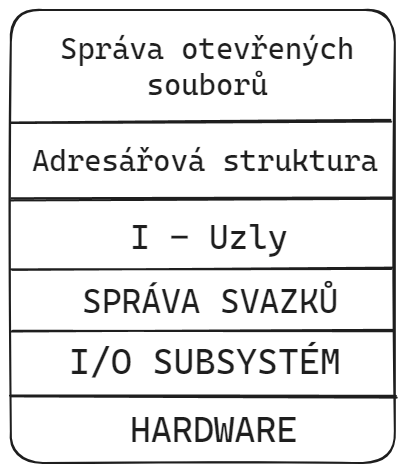

import DescritpionImage from "@site/src/components/DescriptionImage/index"

# Souborový systém
- Organizace informací v OS.
- Pro běh OS je nutné **trvalé** uložení dat.
- **UNIX** -> struktura modelů.

## Svazky
- Správa svazků - Nejnižší logická vrstvou Souborového systému.
- Stará se o fyzické uložení SS na blokovém zařízení. Tj., zařízení, které je tvořeno bloky o stejné velikosti.
- Disk, různé elektronické paměti (fleška, regiony OP)
- I/O Subsystém - Propojení mezi vrstvami, nabízí vyšším vrstvám logické disky, jejichž bloky jsou adresovány lineárně
- Na logickém disku vytváří souborový systém logický prostředek -> **svazek**.
- **Svazek**- je tvořen několika sekcemi, některé obsahují globální informace o dané instanci souborového systému, jiné metadata -> (data o datech) o uložených souborech a přirozeně i vlastní data souborů. (Reference na data)
- Struktura svazku se liší na novější a starší strukturu svazku

### Starší (jednodušší) přístup rozděluje log. disk na několik málo sektorů:
- **Boot sektor** - Zavádí operační systém
- **Header sektor** - Obsahuje globální data celého SS (informace o obsazení svazků, o volných blocích)
- **Metadata sektorů** - Tabulka I-uzlů
- **Data souborů** - Uložená data

- **Metadata** jsou uložena jen jednou, pokud jsou poškozené celý svazek je (zničen).
- Při přístupu k datům je nutno číst jejich metadata, které jsou uloženy v jiné a často vzdálené sekci -> prodlužuje přístupové doby.
- modernější svazky (systémy). využívají schémata vníž jsou klíčová data duplikována (blíže k datům která popisují).
- tato struktura je nejvhodnější pro cylindrické disky s jednoduchým adresováním založeným na geometrii disku.
- současnosti se však často používají virtuální geo. bez cylindru (bez cylindrického uspořádání) a tak výhody zanikají a zůstává jen duplicita dat.

## Buffery
- Paměťové bloky, zrcadlí obsah fyzických bloků na blokových zařízeních (disky).
- Tři funkce:
    1. Tvoří sdílenou paměť mezi jádrem a nesynchrozivaným čtením a zápisem na disk.
    1. Sjednocují rozhraní k blokovým zařízením. Vyšší vrstvy očekávají logický disk s jednotnými bloky a lineárním adresováním. Buffery právě takové rozhraní vyšším vrstvám nabízejí.
    1. Urychlení přístupu na disk.
- Čtení a zápis se děje do bufferů a nikoliv do pomalých disků.

### Návrh systému bufferů
- Vycházejí z pricipů:
    1. Princip konzistence - Data v bufferu jsou vždy zrcadleny s daty na disku.
    1. Princip shodnosti a sdílenosti - Všechny buffery jsou funkčně shodné a mohou být sdíleny všemi blokovými zařízeními v systému (konkrétní buffer může být použit během své existence pro různá bloková zařízení).
    1. Princip konečných prostředků - Buffery jsou přiděleny již při zavádění OS a dále se nemění.
    1. Princip lenivosti - Zápis bufferů se odkládá tak dlouho jak je možno (tzv. odložený zápis).

### Impelementace bufferů
- Složen z HLAVIČKY a vlastního BUFFERU.
- **Hlavička** obsahuje: 
    - Číslo svazku: informace o právě zrcadleném bloku
    - Informaci zda je buffer právě uzavřen a ukazatel, který zařazuje paměť do některého ze seznamů, ve kterých jsou buffery organizovány.

### Seznamy
- **Seznam volných bufferů** 
    - Stránky, které nezrcadlí žádný blok. 
    - Tento font obsahuje na začátku všechny buffery a během běhu systému se postupně vyprazdňuje, až se zcela vyčerpá, neboť za normálních situacích se nedoplňuje
- **Fronta odemčených bufferů**
    - V ní jsou všechny přidělené (nikoliv volné!) buffery, které nejsou uzamčeny
- **Otevřená Hashovací tabulka všech přidělených bufferů**
    - Skládá se z většího počtu oddělených seznamů, umožňuje rychlé vyhledání bufferů pro daný blok a svazek

<DescriptionImage src="imgs\hashovaciTabulka.png" alt="hashovaciTabulka" description="Hashovaci tabulka"/>

- Proces: možnosti, které mohou nastat při požadavku na zápis do určitého bloku na svazku resp. čtení z tohoto bloku
1. pokud má tento blok již existujíci buffer (zjistí z hashovací tabulky) mohou nastat 2 situace:
    1. pokud je Buffer odemčen, pak ho proces uzamkne a provede příslušnou operaci a ihned potom ho odemkne a probudí případné procesy čekající na tuto paměť
    1. je již zamknut, proces se musí zablokovat
1. Blok není aktuálně zrcadlen
    1. Stále existují nepřidělené buffery
        - proces odebere buffer z fondu nepřidělených, změní jeho hlavičku, na hlavičku požadovaného bloku a zařadí jej do hashovací tabulky (do příslušného seznamu) a zamkne jej, všechny tyto operace musejí být řešeny atomicky
        - Během jeho zablokování je přesun dat z , a poté se může odemknout
1. Neexistují žádné nepřidělené buffery
    - Musí být ukradeny některé z odemčených (ale již samožřejmě přidělených) bufferů.
    - Měl by to být buffer ze začátku fronty (je již dlouhou dobu nepoužíván).
    - Zde mohou nastat 2 podsituace zda je buffer na začátku fronty:
        - **Čistý** => nezměněn oproti diskovému, další činnost obdobná přidělení volné paměti.
            - Nejdříve je však nutno paměť vyjmout jak z fronty tak hashovací tabulky.
            - Paměť je uzamčena a vložena na jiné místo v hashovací tabulce (nyní již podle nového čísla bloku) a následně je naplánováno čtení daného bloku. Po odblokování je buffer použit a odemčen (opět se objeví ve frontě, na konci).
            - Dále je již vše stejné.
            - Změněno označení bloku.
        - **Špinavý** => změněn oproti diskovému (s odloženým zápisem).
            - Buffer není ještě uložen tj. se špinavým neboli odloženým zápisem.
    
# Subsystém I/O
- Zajišťuje komunikaci s hardwarovými zařízeními (s výjimkou OP a procesoru, o než se stará správce paměti, resp. správce procesů).
- Tento subsystém využívá i navíc další moduly jádra, především modul SS, ale i modul správy paměti -> SWAP.
- Největší význam 3 periferních zařízeni:
    - Vnější paměťová zařízení s blokovým přístupem.
    - Vstupně výstupní zařízení se sekvenčním přístupem (myš, klávesnice, ..).
    - Počítačová síť.
- Skládá se z ovladačů (driverů).

# Ovladače
- mezi HW a OS
- jednotné rozhraní
- v nejnižší vrstvě přistupuje k HW (registry). Tato nejnižší vrstva je součástí **HAL**. Je přímo závislá na HW.

## Rozhraní ovladačů
- Dva protikladné požadavky
    - Specializovaná rozhraní.
    - Jednotné rozhraní.
- Vnější rozhraní ovladačů
    - **Základní rozhraní**
        - Operace, které lze definovat u většinu ovladačů, je jednotné.
        - Dummy funkce: v případě potřeby specializované služby, kterou nepodporuje základní rozhraní, tak přesměruje do **specializované funkce**. 
        - Základní obecně podporované operace:
            - **INIT** => počáteční inicializace zařízení, provádí se při startu systému nebo připojené zařízení.
            - **TERMINATE** => odpojení zařízení.
            - **OPEN** => otevření zařízení procesem.
            - **CLOSE** => zavření zařízení procesem.
            - GET, READ, 
    - Specifické rozhraní -> operace, které jsou specifické pro daný typ zařízení.

### Identifikace rozhraní a ovladače
- Zařízení jsou identifikována dvouurovňovým identifikátorem, který je tvořen dvěma čísli
    - Major (hlavní) = Identifikuje ovladač (přes index) do tabulky ovladačů. Tabulka obsahuje odkazy na rutiny jednotlivých služeb daného ovladače.
    - Minor (vedlejší) = Parametr rutiny, které identifikuje zařízení, která jsou aktuálně obsluhována daným ovladačem.
- Index do tabulky zařízení, která je tentokrat uložena v rámci daného ovladače. Tato tabulka obsahuje údaje o fyzických adresách jednotlivých zařízení.

#### Horní a dolní polovina ovladače
U asynchronních zařízení se ovladač skládá ze dvou částí (označovaných jako poloviny), které se výrazně liší a to jak svým umístěním v jádře OS, tak svou funkcí. Tzv. horní polovina ovladače je běžnou rutinou jádra (tj. je volána jako běžná procedura) a zajišťuje rozhraní vůči vyšším vrstvám (viz operace ovladače výše). Dolní polovina je však obslužnou rutinou přerušení, která je vyvoláváno daným zařízením. Není proto přímo vyvolána zbytkem jádra (tj. ani dolní polovinou) a běží vůči zbytku jádra asynchronně (tj. může být vyvolána mezi jakýmikoliv dvěma instrukcemi jádra, bez ohledu na to jaká rutina resp. jaký proces právě běží). Přerušení je ve většině případů vyvoláno v případě, že zařízení provedlo výstup (u výstupních zařízení), resp. na zařízení se objevila vstupní data (u zařízení vstupních). Mezi horní a dolní polovinou ovladače leží softwarová vyrovnávací paměť (jedině přes ni mohou obě asynchronní části komunikovat). Paměť je vyhrazena jádrem v operační paměti (v oblasti spravované jádrem).