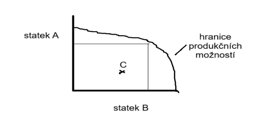

## Fáze hospodářského procesu

1. **Výroba**

   - Přetváří se příroda ve statky a služby za pomoci tzv. vstupů => práce, přírodní zdroje
   - Výsledkem jsou výstupy => výrobky
   - Výrobní faktory každé země jsou omezené
   - Hranice produkčních možností
     - Stát může vyprodukovat jen omezené množství statků a služeb
     - Hranice ukazuje max. množství produkce
     - Nemůže vyrábět více jednoho statku, aniž by se nevyrábělo méně druhého
     - Bod C ukazuje plýtvání zdroji
     - Posun hranice produkčních možností: Technický pokrok, Lepší organizace práce, Úspora surovin

   

   **Čtyři výrobní faktory**:

   - přírodní zdroje
   - práce (lidský faktor)
   - kapitál
   - informace

   **Práce** _Cílevědomá činnost, při které nám vznikají statky a služby_

   - **cena práce**: mzda
   - **produktivita práce**: výkon, který můžeme měřit
   - **dělba práce**: _každý dělá, to co má._ (specializace => rozdělení činnosti)
   - **produktivita práce**: jak moc dobře práci dělám za čas
   - **přírodní zdroje**: slunce, voda, vítr, půda, energie

   :::tip Mzda vs. Plat
   **Plat** pobírají státní zaměsnanci, mzdu pobírají ostatní zaměstnanci
   :::

   **Kapitál** _Nejen finační prostředky, ale také majetek_

   - cenou je zisk nebo úrok

   Zdroje kapitálu:

   - vlastní: vlastní peníze, které vkládám do podnikání třeba, zisk
   - cizí: půjčka, úvěr

   **Informace**

   - důležitá kvalita informací
   - je to nový faktor

1. **Rozdělování a přerozdělování**
1. **Směna**
1. **Spotřeba**
   - konečná
   - výrobní
