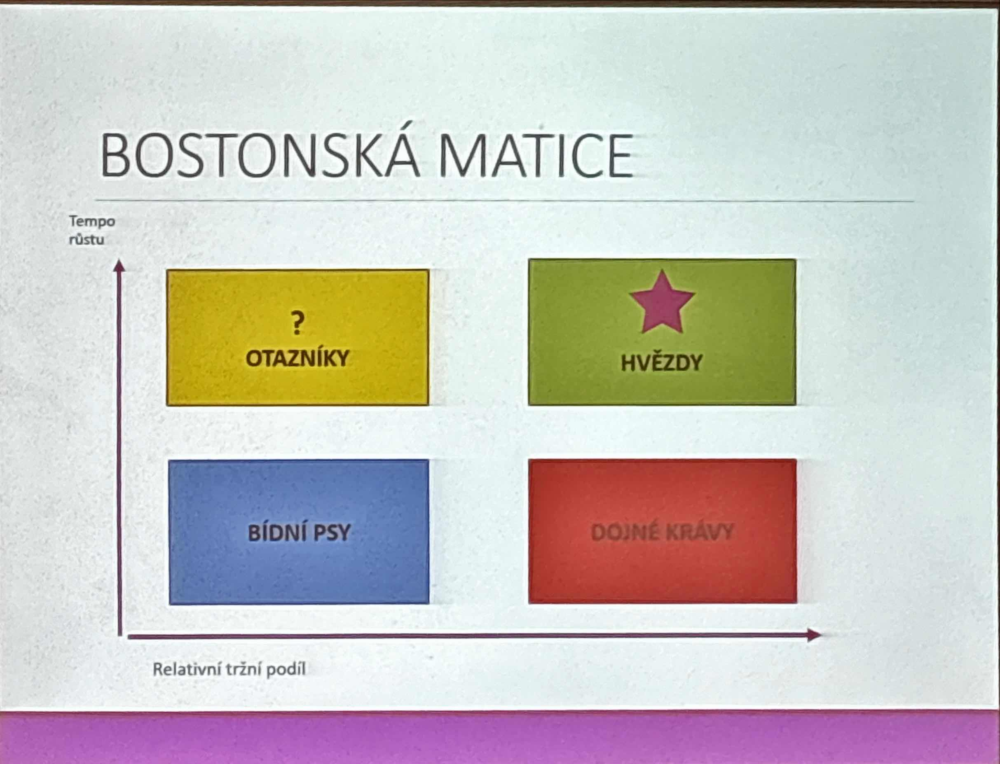

# Marketing

## Dva přístupy
1. Soustředí se na potřeby zákazníků
2. Snaží se vzbudit zájem o výrobek 

## Cesty k uspokojení potřeb zákazníků
- Cílený marketing 
  - **Segmentace** (rozdělnení): rozdělení cílových skupin zákazníku, podle např. *věku, zájmů, sociální situace, lokace* 
  - **Targeting**: Vybrání segmentu podle atraktivnosti (zájem zákazníka) nebo s ohledem na konkurenci (šance uspěchu vzhledem ke konkurenci)
  - **Positioning**: 
    - Aktivity, které v zákaznících vybudují image k našemu produktu, cíle jsou odlišit se od konkurence, vytvořit image té značky a vymezit důvody proč?
    - **Vztah kvalita-cena** *prémiové značky/vysoká kvalita produktu, nízká kvalita/nízká cena*
    - **Zdůraznění užitku** upozornění na přínos produktu
    - **Vzbuzování emocí** spojení například se zábavou *Kofola*
    - **Vyjádření identity** *apple uživatelé*

## Individualizovaný marketing
- Idivinduální potřeby podle potřeb zákazníka *zboží na zakázku* 
- Technologie umožňují *3D tiskárny*

## Strategický plán
- Firmy vybírají ze strategií
  - **Vůdčí postavení v nákladech**
  - **Diferenciace** - jedinečný produk odlišný od konkurence
  - **Koncentrace** - soustředění se na uzký segment zákazníků

## Marketingový mix
- 4 základní nástroje marketingu
- Označují se jako 4P
  - Product *statky, služby*
  - Price *cena*
  - Place *místo prodeje*
  - Promotion *podpora prodeje*
  
## Výrobek 
- Je jakýkoliv statek a nebo služba.
- 3 fáze
  1. fáze 
     - *uvedení výrobku* 
     - 2-3% zákazníků
     - nejvyšší růst zákazníků
  2. fáze 
     - *růst výrobků*
     - 20-30% zákazníků
     - menší růst zákazníků
  3. fáze 
     - *zralost výrobku*
     - nejvyšší poptávka, nejdelší 
  4. fáze
     - *upad výpadku*
     - prodejnost klesá
     - je nutno produkt nahradit novým 

## BCG MATICE 
- bostonská matice
- používá se při plánovaní/hodnocení firmy

# Tři péčka 
## Produkt (*p  roduct*)
## Cena (*price*)
- úkolem marketingu je přesvědčit zákazníka, že stanovená cena je vlastně nízká
- Cena výrobku může vycházet z:
  - nákladově orientované ceny
  - ceny podle konkurence
  - ceny podle hodnoty vnímané zákazníkem
- **Formy cenové politky**
  - Vyšší ceny než tržní *u luxusní zboží pro menší obchod zákazníků*
  - Cenny nižší než tržní *zaváděny proto, aby si záklazníci výrobky oblíbili a zvykli si na ně*
  - Ceny tržní *ceny jsou srovnatelné s konkurencí*

## Propagace (*promotions*)
- Rozlišujou se reklamy 
  - Primární *zaměřena na druh výrobu*
  - Selektivní *souhrnně na výrobky jedné firmy* 
- **Propagační mix**
  - Reklama
  - Podpora prodejce *ochutnávky, vzorky, stánky*
  - Public relations *rozšíření nenásilně pomocí medií* 
  - Přímý marketing *přímá komunikace se zákazníky*
  - Osobní prodej *popis produktu před prodejem*

## Distribuce (*place*)
- Místo (lokace, rozloha) prodeje produktu *maloobchody, velkoobchody*
- Součástí je přeprava, skladování, prodejní servis, ale i poskytované úvěry při prodeji výrobků